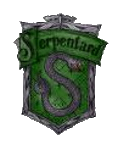
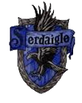
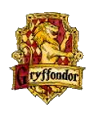
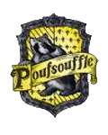

***

[L'école](./index.md)
 | 
[Les Maisons](./houses.md)
 |
[Devenir enseignant](./apply.md)

***

# Maisons
            
La Répartition influence la scolarité de chaque élève tout au long de leurs sept ans d'études. Les élèves d'une maison partagent leur histoire, leur salle commune, leurs dortoirs et sont ensemble en salle de classe. Tous ont également le même but : faire gagner la Coupe des Quatre Maisons à la leur ainsi que la Coupe de Quidditch pour les élèves sélectionnés dans l'équipe de leur maison. Les maisons sont sous la gérance des directeurs de maison.

## Serpentard

        
**Serpentard** a été fondée par **Salazar Serpentard**. Son emblème, **le serpent**, rend hommage à ses dons de Fourchelang et ses couleurs sont le vert et l'argent. 

Serpentard valorise la grandeur, la **ruse, l'ambition et la fierté**. Sa salle commune se situe dans les cachots, sous le lac de O'dlard et son fantôme est le Baron Sanglant. 

Serpentard est connue pour avoir formé des sorciers de renom et populaires, tels que *Merlin* et *Severus Rogue*.
                

## Serdaigle

C'est **Rowena Serdaigle** qui a fondé la maison **Serdaigle**. Représentée par **un aigle**, ses couleurs sont le bleu et le bronze.

**L'intelligence, la sagesse, la créativité, l'originalité et la curiosité** font partie des valeurs les plus importantes de cette maison, dont la salle commune est une des plus hautes tours du château de O'dlard. Son fantôme est la Dame Grise.

Serdaigle compte parmi ses élèves les plus connus *Ignatia Wildsmith*, *Perpetua Fancourt* et *Lorcan McLaird notamment*.
                
## Gryffondor

**Gryffondor** a été fondée par **Godric Gryffondor**. Ses couleurs sont le rouge et l'or et son emblème est **le lion**. 

Elle valorise **le courage, la hardiesse, la force, la bravoure et la détermination**. Sa salle commune est située au septième étage. Le fantôme attaché à Gryffondor est Nick Quasi-Sans-Tête.

La maison compte parmi ses élèves les plus célèbres *Albus Dumbledore*, *Celestina Moldubec*, *Minerva McGonagall* ou encore *Harry Potter*.
                
## Poufsouffle

Fondée par **Helga Poufsouffle**, **Poufsouffle** est représentée par **un blaireau** et ses couleurs sont le jaune et le noir.

On trouve parmi les nombreuses qualités des Poufsouffle **la loyauté, la patience, le goût du travail acharné, l'honnêteté et la tolérance**. Sa salle commune, connue pour être la plus inaccessible, est située dans les sous-sols, près des cuisines. Son fantôme est le Moine Gras.

*Brigitte Wenlock*, *Artemisia Lufkin*, *Norbert Dragonneau* font partie des élèves les plus célèbres de la maison.

*** 

## Inscription

Les sorciers et sorcières sont inscrits à O'dlard dès leur naissance et reçoivent une lettre d’admission par hibou pour leur première rentrée, à l’âge de 11 ans.

*** 